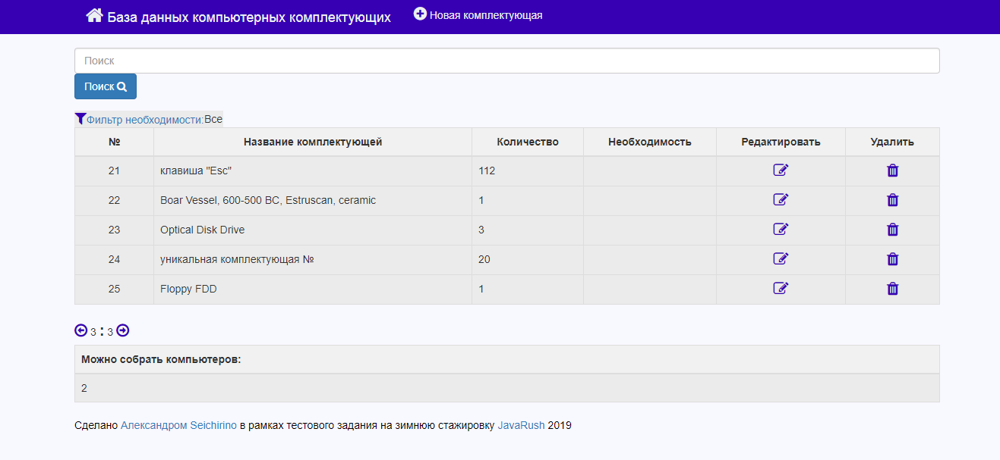

# Тестовое задание JavaRush 2019

## Установка:
$> git clone https://github.com/seichirino/JavaRushTestTask.git

## База данных:

База данных - test

Логин и пароль - root

Порт - 3306

Скрипты базы находятся в папке /scripts/

## Cкрипты:

**createAndFill.sql** - создает таблицу test и наполняет её значениями

**workaroundForAuthentification.sql** - Исправление/обход для *java.sql.SQLException Unable to load authentication plugin 'caching_sha2_password'*, возникающего в случае если jdbc.Driver пытается подключится к базе данных используя MysqlNativePassword, а база данных использует Sha256Password.

## Запуск:

Программа написана с использованием springboot, поэтому сама собирает maven проект и запускает tomcat сервер по адресу http://localhost:8080

